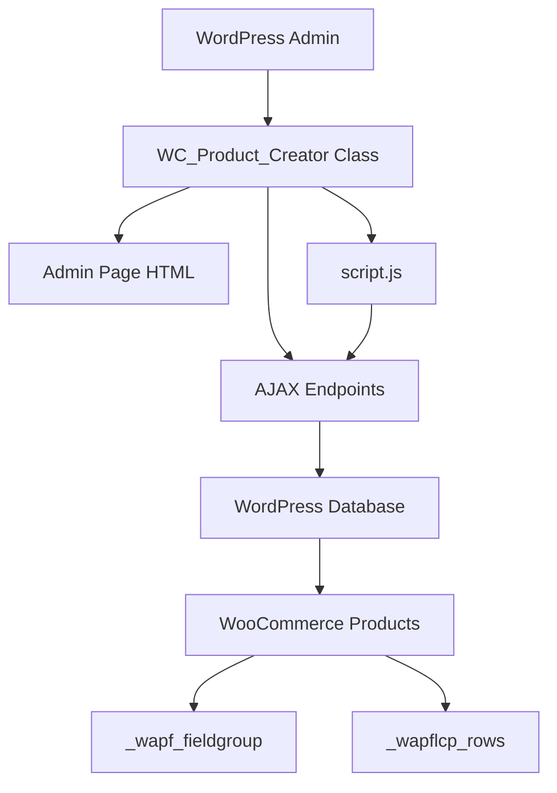
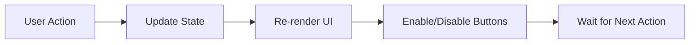
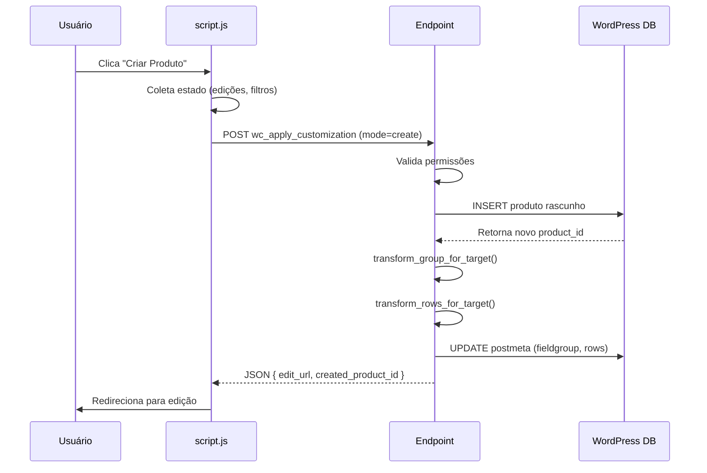
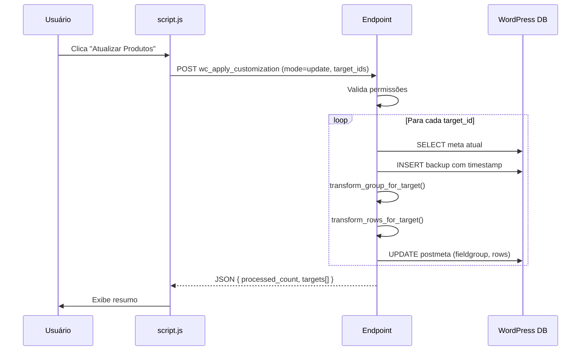

import { Aside } from '@astrojs/starlight/components';

Esta página oferece uma visão de alto nível da arquitetura do WC Product Creator, explicando como os componentes se conectam e interagem.

## Componentes Principais



### 1. Classe Principal (PHP)

**Arquivo:** `wc-product-creator.php`

**Responsabilidades:**
- Registrar menu admin (`admin_menu`)
- Enfileirar assets (`admin_enqueue_scripts`)
- Definir endpoints AJAX (`wp_ajax_*`)
- Transformar e sanitizar metadados
- Gerenciar backups

**Padrão:** Singleton implícito via instantiação direta no load.

```php
class WC_Product_Creator {
  public function __construct() {
    add_action('admin_menu', [$this, 'add_admin_page']);
    add_action('admin_enqueue_scripts', [$this, 'enqueue_assets']);
    add_action('wp_ajax_wc_apply_customization', [$this, 'ajax_apply_customization']);
    // ... outros hooks
  }
}

new WC_Product_Creator();
```

---

### 2. Interface Admin (HTML)

**Método:** `render_admin_page()`

**Estrutura:**
```html
<div class="wrap">
  <h1>WC Product Creator</h1>
  
  <!-- Mode Switcher -->
  <button id="mode-toggle">Criar / Atualizar</button>
  
  <!-- Formulário de entrada -->
  <select id="base-product">...</select>
  <button id="load-content">Carregar conteúdo</button>
  
  <!-- Grids de seleção -->
  <div id="fields-grid">...</div>
  <div id="rows-grid">...</div>
  
  <!-- Painel de offset global -->
  <div id="global-offset-panel">...</div>
  
  <!-- Botões de ação -->
  <button id="create-product">Criar</button>
  <button id="update-products">Atualizar</button>
  
  <!-- Preview -->
  <button id="generate-preview">Gerar prévia</button>
  <div id="preview-container">...</div>
</div>
```

**Localização:** Strings i18n via `wp_localize_script()` em objeto `WPCreatorAjax`.

---

### 3. Lógica Client-Side (JavaScript)

**Arquivo:** `script.js`

**Padrão:** State management manual + listeners de eventos.

**Estado global:**
```javascript
const state = {
  mode: 'create',
  baseProductId: null,
  fields: [],
  rows: [],
  editedRows: [],
  selectedFieldIds: [],
  selectedRowIndices: [],
};
```

**Fluxo de eventos:**


**Principais funções:**
- `loadContent()`: Busca dados do produto base
- `applyGlobalOffset()`: Calcula offsets em todas as linhas
- `renderGrid()`: Renderiza cards de seleção
- `renderRowEditorLazy()`: Cria editor inline
- `generatePreview()`: Chama endpoint de preview

---

### 4. Endpoints AJAX (PHP)

#### `wc_fetch_fieldgroup_fields`

**Propósito:** Carregar campos e linhas do produto base para UI

**Flow:**
```php
1. Validar nonce + capability
2. Buscar produto base
3. Obter _wapf_fieldgroup e _wapflcp_rows
4. Derivar labels amigáveis
5. Detectar status de cores
6. Retornar JSON estruturado
```

---

#### `wc_apply_customization`

**Propósito:** Criar ou atualizar produtos com customizações

**Flow:**
```php
1. Validar nonce + capability
2. Parse de parâmetros (mode, base_id, keys_to_copy, etc.)
3. Se mode == create:
   a. Criar produto rascunho
   b. Definir título + thumbnail
4. Se mode == update:
   a. Loop em target_ids
   b. Criar backups
5. Transformar metadados:
   a. Fieldgroup: ajustar ID do grupo
   b. Rows: filtrar subset, aplicar edições, substituir imagens
6. Salvar em cada produto
7. Retornar URLs de edição
```

---

#### `wcpc_get_preview_data`

**Propósito:** Retornar dados de posicionamento para preview client-side

**Flow:**
```php
1. Validar nonce + capability (edit_products)
2. Buscar _wapflcp_rows do produto
3. Aplicar edited_rows temporariamente (sem salvar)
4. Extrair coordenadas + dimensões
5. Obter URL da thumbnail
6. Retornar JSON
```

---

### 5. Banco de Dados (WordPress)

**Tabelas usadas:**
- `wp_posts`: Produtos WooCommerce
- `wp_postmeta`: Metadados customizados

**Meta keys relevantes:**

| Key | Tipo | Descrição |
|-----|------|-----------|
| `_wapf_fieldgroup` | Serialized Array | Configuração de campos WAPF |
| `_wapflcp_rows` | Serialized Array | Linhas de layout customizável |
| `_thumbnail_id` | Integer | ID da imagem destacada |
| `_backup_wapf_fieldgroup_{ts}` | Serialized Array | Backup antes de update |
| `_backup_wapflcp_rows_{ts}` | Serialized Array | Backup antes de update |

<Aside type="note">
WordPress serializa arrays PHP automaticamente via `maybe_serialize()` ao salvar com `update_post_meta()`.
</Aside>

## Pipeline de Transformação

### Criação de Produto



### Atualização de Produtos



## Transformações de Metadados

### Fieldgroup (`_wapf_fieldgroup`)

**Estrutura original:**
```json
{
  "id": "p_123",
  "name": "Campos de personalização",
  "fields": [
    { "id": "field_abc", "label": "Nome" },
    { "id": "field_xyz", "label": "Tamanho" }
  ]
}
```

**Transformação para produto 456:**
```php
$group['id'] = "p_456"; // Ajusta ID

// Se houver subset:
$group['fields'] = array_filter($group['fields'], function($field) use ($subset) {
  return in_array($field['id'], $subset);
});
```

**Resultado:**
```json
{
  "id": "p_456",
  "name": "Campos de personalização",
  "fields": [
    { "id": "field_abc", "label": "Nome" }
    // field_xyz removido se não estava no subset
  ]
}
```

---

### Rows (`_wapflcp_rows`)

**Estrutura original:**
```json
[
  { "x": 100, "y": 200, "image": 999, "url": "base.jpg" },
  { "x": 150, "y": 250, "color": "#ff0000" }
]
```

**Transformações aplicadas:**

1. **Subset:** Manter apenas índices selecionados
2. **Edições:** `apply_row_edits()` → posições ajustadas
3. **Imagem:** `transform_rows_for_target()` → substituir 999 por thumbnail do target

**Exemplo com target 456 (thumbnail 1001):**
```json
[
  { "x": 150, "y": 180, "image": 1001, "url": "target.jpg" },
  { "x": 150, "y": 250, "color": "#ff0000" }
]
```

**Nota:** `color` é preservado (herdado), mas não pode ser editado.

## Segurança em Camadas

### Camada 1: Nonce Validation

```php
if (!check_ajax_referer('action_name', 'nonce', false)) {
  wp_send_json_error('Invalid nonce', 403);
}
```

**Protege contra:** CSRF (Cross-Site Request Forgery)

---

### Camada 2: Capability Check

```php
if (!current_user_can('manage_options')) {
  wp_send_json_error('Permission denied', 403);
}
```

**Protege contra:** Usuários não-autorizados executarem ações admin

---

### Camada 3: Whitelist de Meta Keys

```php
$allowed_keys = ['_wapf_fieldgroup', '_wapflcp_rows'];

foreach ($keys_to_copy as $key) {
  if (!in_array($key, $allowed_keys, true)) {
    continue; // Ignora keys não-autorizadas
  }
}
```

**Protege contra:** Modificação de metadados arbitrários (ex: `_price`)

---

### Camada 4: Sanitização de Edições

```php
private function sanitize_row_patch($patch, $row) {
  // Remove cores
  if (in_array($key, ['color', 'fill', 'stroke'], true)) {
    continue;
  }
  
  // Valida tipos
  if ($type === 'number') {
    $sanitized[$key] = floatval($value);
  }
}
```

**Protege contra:** Injeção de propriedades maliciosas

---

### Camada 5: Escape de Output

```php
echo '<h1>' . esc_html__('WC Product Creator', 'wc-product-creator') . '</h1>';
```

**Protege contra:** XSS (Cross-Site Scripting)

## Extensibilidade

### Adicionar Novo Endpoint

1. **Registrar ação:**
```php
add_action('wp_ajax_my_custom_endpoint', [$this, 'ajax_my_custom']);
```

2. **Implementar método:**
```php
public function ajax_my_custom() {
  check_ajax_referer('my_nonce', 'nonce');
  // ... lógica
  wp_send_json_success($data);
}
```

3. **Chamar do JS:**
```javascript
jQuery.post(ajaxurl, {
  action: 'my_custom_endpoint',
  nonce: WPCreatorAjax.nonces.my_nonce,
  // ... dados
}, function(response) {
  console.log(response.data);
});
```

---

### Adicionar Nova Transformação

Criar método privado na classe:

```php
private function my_custom_transform($data, $product_id) {
  // Exemplo: adicionar timestamp
  $data['modified_at'] = time();
  return $data;
}
```

Chamar no pipeline de transformação:

```php
$group = $this->transform_group_for_target($group, $target_id, $subset);
$group = $this->my_custom_transform($group, $target_id); // Nova linha
```

## Dependências

### WordPress Core
- `add_action()` / `add_filter()`
- `wp_ajax_*` hooks
- `wp_send_json_success()` / `wp_send_json_error()`
- `check_ajax_referer()`
- `current_user_can()`

### WooCommerce
- `wc_get_product()`
- Tipos de produto (WC_Product)
- Metadados de produto

### Plugins de Terceiros (Soft Dependency)
- **WAPF (WooCommerce Advanced Product Fields):** Fornece estrutura `_wapf_fieldgroup`
- **Custom Product Layout:** Fornece estrutura `_wapflcp_rows`

<Aside type="caution">
O plugin **não valida** a estrutura desses metadados. Se WAPF mudar o schema, transformações podem quebrar. Monitore atualizações desses plugins.
</Aside>

## Performance

### Otimizações Aplicadas

1. **Lazy rendering:** Editores de linha só são renderizados ao expandir
2. **Single query:** Busca produtos com `get_posts()` em vez de loops
3. **Cached labels:** Mapa de labels construído 1x por request

### Possíveis Gargalos

- **Muitas linhas:** >100 linhas pode deixar UI lenta
- **Múltiplos targets:** Atualizar 50+ produtos simultaneamente é lento
- **Imagens grandes:** URLs de thumbnails podem ser pesadas no JSON

**Mitigação futura:** Paginar resultados, usar web workers, lazy load imagens.

## Próximos Passos

- **[Guias de Uso](/guias/criando-produtos/)** - Como usar o sistema
- **[Referência de Endpoints](/referencia/endpoints-ajax/)** - Detalhes técnicos
- **[Desenvolvimento](/desenvolvimento/configuracao/)** - Setup de ambiente
