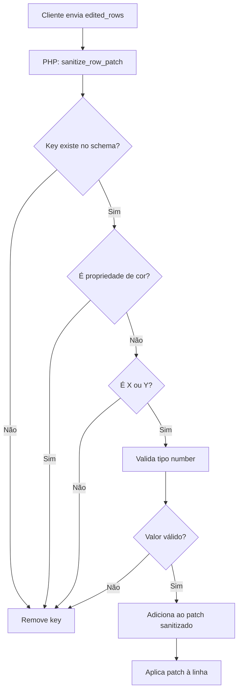

import { Aside, Tabs, TabItem } from '@astrojs/starlight/components';

O WC Product Creator implementa uma **restrição de edição** que permite modificar apenas as coordenadas X e Y dos elementos de layout, bloqueando propriedades de estilo como cor, tamanho e rotação.

## Motivação

Esta restrição garante **consistência visual** entre produtos derivados:

- ✅ Produtos mantêm a identidade visual do design original
- ✅ Cores da marca permanecem padronizadas
- ✅ Tamanhos de elementos respeitam proporções definidas
- ✅ Apenas o posicionamento é adaptável

<Aside type="tip">
**Filosofia:** O produto base define o "estilo", e produtos derivados herdam esse estilo mas podem ajustar o "layout".
</Aside>

## Propriedades Permitidas

Apenas coordenadas de posicionamento são editáveis:

### ✅ Editáveis

| Propriedade | Aliases aceitos | Tipo |
|-------------|----------------|------|
| Posição X | `x`, `left` | Number |
| Posição Y | `y`, `top` | Number |

### 🔒 Bloqueadas (Herdadas)

| Categoria | Propriedades bloqueadas |
|-----------|------------------------|
| **Dimensões** | `width`, `height`, `w`, `h`, `size` |
| **Cores** | `color`, `fill`, `stroke`, `background` |
| **Rotação** | `rotate`, `rotation`, `angle` |
| **Alinhamento** | `align`, `text-align`, `valign` |
| **Tipografia** | `font-size`, `font-family`, `font-weight`, `line-height` |
| **Efeitos** | `opacity`, `shadow`, `border`, `border-radius` |

## Implementação

A restrição é aplicada em **duas camadas**:

### 1. Front-end (JavaScript)

**Interface limitada:**
```javascript
// script.js - renderRowEditorLazy()
function renderRowEditorLazy(row, index) {
  const xKey = getActualKey(['x', 'left']);
  const yKey = getActualKey(['y', 'top']);
  
  return `
    <label>Posição X: <input type="number" data-key="${xKey}"></label>
    <label>Posição Y: <input type="number" data-key="${yKey}"></label>
    <aside>
      Somente posições podem ser editadas. 
      Cores e tamanhos são herdados do produto base.
    </aside>
  `;
}
```

**Resultado:** Interface não oferece campos para editar outras propriedades.

---

### 2. Back-end (PHP)

**Sanitização agressiva:**
```php
// wc-product-creator.php - sanitize_row_patch()
private function sanitize_row_patch($patch, $row) {
  $schema = $this->infer_row_schema($row);
  $sanitized = [];
  
  foreach ($patch as $key => $value) {
    // Remove cores explicitamente
    if (in_array($key, ['color', 'fill', 'stroke'], true)) {
      continue; // ⛔ Bloqueado
    }
    
    // Permite apenas keys do schema original
    if (!isset($schema[$key])) {
      continue; // ⛔ Não existe na linha original
    }
    
    // Valida tipo esperado
    $type = $schema[$key];
    $sanitized[$key] = $this->sanitize_by_type($value, $type);
  }
  
  return $sanitized;
}
```

**Resultado:** Mesmo que cliente malicioso envie propriedades bloqueadas, serão removidas.

## Detecção de Schema

O plugin infere o schema analisando a linha original:

```php
private function infer_row_schema($row) {
  $schema = [];
  
  foreach ($row as $key => $value) {
    if (is_numeric($value)) {
      $schema[$key] = 'number';
    } elseif (is_bool($value)) {
      $schema[$key] = 'boolean';
    } elseif (is_string($value)) {
      // Detecta cores por padrão hex
      if (preg_match('/^#[0-9A-F]{6}$/i', $value)) {
        $schema[$key] = 'color';
      } else {
        $schema[$key] = 'text';
      }
    }
  }
  
  return $schema;
}
```

**Exemplo:**

<Tabs>
<TabItem label="Linha Original">

```json
{
  "x": 100,
  "y": 200,
  "width": 300,
  "height": 50,
  "color": "#ff0000",
  "text": "Nome"
}
```

</TabItem>

<TabItem label="Schema Inferido">

```json
{
  "x": "number",
  "y": "number",
  "width": "number",
  "height": "number",
  "color": "color",
  "text": "text"
}
```

</TabItem>

<TabItem label="Patch Enviado">

```json
{
  "x": 150,
  "y": 180,
  "width": 400,
  "color": "#00ff00"
}
```

</TabItem>

<TabItem label="Patch Sanitizado">

```json
{
  "x": 150,
  "y": 180
  // width removido (não é posição)
  // color removido (bloqueado explicitamente)
}
```

</TabItem>
</Tabs>

## Fluxo de Validação



## Sanitização por Tipo

```php
private function sanitize_by_type($value, $type) {
  switch ($type) {
    case 'number':
      // Suporte PT-BR: converte vírgula em ponto
      if (is_string($value)) {
        $value = str_replace(',', '.', $value);
      }
      return is_numeric($value) ? floatval($value) : null;
      
    case 'boolean':
      return (bool) $value;
      
    case 'color':
      // Valida formato hex
      return preg_match('/^#[0-9A-F]{6}$/i', $value) ? $value : null;
      
    case 'text':
      return sanitize_text_field($value);
      
    default:
      return null;
  }
}
```

## Resolução de Aliases

Diferentes sistemas usam nomes diferentes para as mesmas propriedades:

```javascript
// script.js
function getActualKey(aliases) {
  // Procura qual alias a linha usa
  for (const alias of aliases) {
    if (row.hasOwnProperty(alias)) {
      return alias;
    }
  }
  return aliases[0]; // Fallback para primeiro
}

// Uso:
const xKey = getActualKey(['x', 'left', 'posX']);
const yKey = getActualKey(['y', 'top', 'posY']);
```

**Por que?** Plugins diferentes usam convenções diferentes:
- WAPF pode usar `x`/`y`
- Outros podem usar `left`/`top`
- CSS prefere `left`/`top`

O plugin detecta automaticamente qual nome está em uso.

## Segurança

### Tentativas de Bypass

**❌ Ataque 1: Enviar propriedades bloqueadas**

```json
// Cliente tenta:
{
  "edited_rows": [
    { "index": 0, "patch": { "x": 100, "color": "#ff0000" } }
  ]
}

// PHP remove automaticamente:
{
  "edited_rows": [
    { "index": 0, "patch": { "x": 100 } }
  ]
}
```

---

**❌ Ataque 2: Criar keys inexistentes**

```json
// Cliente tenta:
{
  "patch": { "x": 100, "malicious_script": "<script>..." }
}

// Schema não tem 'malicious_script' → removido
```

---

**❌ Ataque 3: Modificar schema via JavaScript**

```javascript
// Cliente tenta modificar no console:
row.schema.width = 'number';

// Não funciona: schema é inferido no backend, não enviado pelo cliente
```

### Validação de Capability

```php
// No início de cada endpoint AJAX
if (!check_ajax_referer('wc_apply_customization', 'nonce', false)) {
  wp_send_json_error('Invalid nonce', 403);
  return;
}

if (!current_user_can('manage_options')) {
  wp_send_json_error('Permission denied', 403);
  return;
}
```

Mesmo com sanitização perfeita, apenas usuários autorizados podem chamar os endpoints.

## Exemplos de Edição

### ✅ Permitido

```json
{
  "index": 0,
  "patch": {
    "x": 150,
    "y": 200
  }
}
```

---

### ❌ Bloqueado Parcialmente

```json
// Entrada:
{
  "index": 0,
  "patch": {
    "x": 150,
    "y": 200,
    "width": 400,
    "color": "#ff0000"
  }
}

// Resultado aplicado:
{
  "index": 0,
  "patch": {
    "x": 150,
    "y": 200
    // width e color removidos
  }
}
```

---

### ❌ Totalmente Bloqueado

```json
// Entrada:
{
  "index": 0,
  "patch": {
    "width": 400,
    "height": 50,
    "color": "#ff0000"
  }
}

// Resultado aplicado:
{
  "index": 0,
  "patch": {}
  // Patch vazio = linha não alterada
}
```

## Limitações e Contornos

### Limitação 1: Não pode mudar cor de elemento individual

**Contorno:** Edite o produto base e re-aplique para todos os derivados.

---

### Limitação 2: Não pode redimensionar elementos

**Contorno:** 
1. Edite produto base
2. Use modo Atualizar para sincronizar

---

### Limitação 3: Não pode adicionar/remover linhas

**Contorno:** Use filtros de seleção para copiar apenas as linhas desejadas.

## Extensão Futura

Se precisar permitir edição de outras propriedades:

<Tabs>
<TabItem label="1. Front-end">

```javascript
// script.js - adicionar campo
function renderRowEditorLazy(row, index) {
  return `
    <label>Posição X: <input data-key="x"></label>
    <label>Posição Y: <input data-key="y"></label>
    
    <!-- NOVO: Permitir rotação -->
    <label>Rotação (graus): <input data-key="rotate"></label>
  `;
}
```

</TabItem>

<TabItem label="2. Back-end">

```php
// wc-product-creator.php - atualizar lista
private function sanitize_row_patch($patch, $row) {
  // Remover 'rotate' da lista de bloqueados
  $blocked = ['color', 'fill', 'stroke']; // antes tinha 'rotate'
  
  foreach ($patch as $key => $value) {
    if (in_array($key, $blocked, true)) {
      continue;
    }
    // ... resto da lógica
  }
}
```

</TabItem>

<TabItem label="3. Documentação">

Atualizar:
- Este arquivo (adicionar `rotate` à tabela de editáveis)
- `copilot-instructions.md`
- Strings localizadas em `wp_localize_script()`

</TabItem>
</Tabs>

<Aside type="caution">
**Importante:** Ao adicionar propriedades editáveis, teste com todas as combinações de plugins (WAPF, outros builders) para garantir compatibilidade.
</Aside>

## Próximos Passos

- **[Editando Posições](/guias/editando-posicoes/)** - Guia prático de uso
- **[Referência de Endpoints](/referencia/endpoints-ajax/)** - Detalhes técnicos da API
- **[Arquitetura Geral](/arquitetura/visao-geral/)** - Como o sistema se integra
