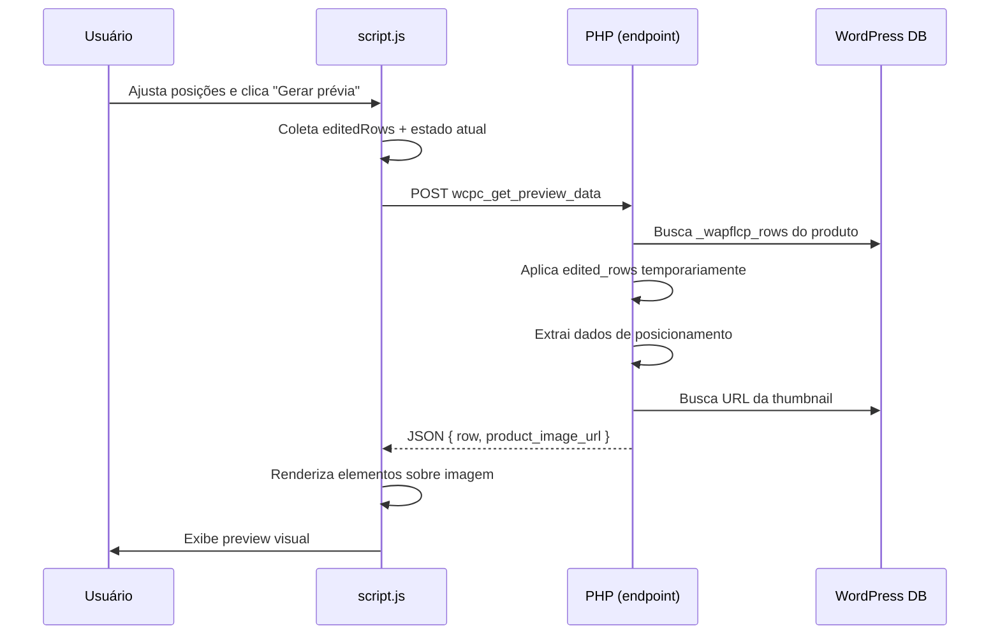

import { Aside, Tabs, TabItem } from '@astrojs/starlight/components';

O **Sistema de Preview** permite visualizar como as linhas de layout ficarão posicionadas antes de criar ou atualizar produtos, economizando tempo e evitando erros.

## Visão Geral

O preview funciona assim:

1. **Usuário ajusta posições** na interface (edições individuais + offset global)
2. **Clica em "✨ Gerar prévia"**
3. **Sistema consulta endpoint** `wcpc_get_preview_data` com edições aplicadas
4. **Servidor retorna JSON** com dados de posicionamento e URL da imagem
5. **Cliente renderiza preview** sobrepondo elementos na imagem

<Aside type="note">
**Arquitetura:** O preview é gerado **no cliente** (JavaScript). O servidor apenas fornece dados estruturados; não há renderização de imagem server-side.
</Aside>

## Fluxo de Funcionamento



## Endpoint AJAX

### URL e Ação

```
POST /wp-admin/admin-ajax.php
action: wcpc_get_preview_data
```

### Autenticação

- **Nonce:** `wc_apply_customization` (compartilhado com endpoint de aplicação)
- **Capability:** `edit_products`

<Aside type="tip">
Preview usa capability menos restritiva (`edit_products`) que criação/atualização (`manage_options`), permitindo que editores de produto visualizem sem permissão para modificar.
</Aside>

### Request Payload

```json
{
  "action": "wcpc_get_preview_data",
  "nonce": "abc123...",
  "target_product_id": "789",
  "edited_rows": "[{\"index\":0,\"patch\":{\"y\":180}}]"
}
```

**Parâmetros:**

| Campo | Tipo | Obrigatório | Descrição |
|-------|------|-------------|-----------|
| `target_product_id` | String/Int | ✅ | ID do produto para gerar preview |
| `edited_rows` | String (JSON) | ❌ | Array de edições a aplicar temporariamente |

**Formato de `edited_rows`:**
```javascript
[
  { "index": 0, "patch": { "x": 150 } },
  { "index": 2, "patch": { "y": 200, "x": 100 } }
]
```

### Response

<Tabs>
<TabItem label="Sucesso">

```json
{
  "success": true,
  "data": {
    "row": [
      {
        "x": 150,
        "y": 180,
        "w": 200,
        "h": 30,
        "rotate": 0,
        "size": 16,
        "align": "center"
      },
      {
        "x": 100,
        "y": 250,
        "w": 150,
        "h": 40,
        "rotate": 0,
        "size": 14,
        "align": "left"
      }
    ],
    "product_image_url": "https://example.com/wp-content/uploads/camiseta.jpg"
  }
}
```

**Campos retornados por linha:**
- `x`, `y`: Coordenadas (com edições aplicadas)
- `w`, `h`: Largura e altura
- `rotate`: Rotação em graus
- `size`: Tamanho de fonte (se aplicável)
- `align`: Alinhamento de texto

</TabItem>

<TabItem label="Erro">

```json
{
  "success": false,
  "data": "Product not found"
}
```

**HTTP Status:** 404

**Erros comuns:**
- `Product not found` - ID inválido ou produto deletado
- `Invalid nonce` - Token expirado ou incorreto
- `Permission denied` - Usuário sem `edit_products`

</TabItem>
</Tabs>

## Implementação PHP

### Endpoint Handler

```php
public function ajax_get_preview_data() {
  // Validação
  if (!check_ajax_referer('wc_apply_customization', 'nonce', false)) {
    wp_send_json_error('Invalid nonce', 403);
  }
  
  if (!current_user_can('edit_products')) {
    wp_send_json_error('Permission denied', 403);
  }
  
  // Parâmetros
  $target_id = intval($_POST['target_product_id'] ?? 0);
  $edited_rows_json = $_POST['edited_rows'] ?? '[]';
  $edited_rows = json_decode($edited_rows_json, true) ?: [];
  
  // Buscar produto
  $product = wc_get_product($target_id);
  if (!$product) {
    wp_send_json_error('Product not found', 404);
  }
  
  // Obter rows atuais
  $rows = get_post_meta($target_id, '_wapflcp_rows', true);
  if (!is_array($rows)) {
    $rows = [];
  }
  
  // Aplicar edições temporariamente (não salva)
  $rows = $this->apply_row_edits($rows, $edited_rows);
  
  // Extrair dados de preview
  $preview_data = $this->extract_preview_data($rows);
  
  // URL da imagem
  $thumb_id = get_post_thumbnail_id($target_id);
  $image_url = $thumb_id ? wp_get_attachment_image_url($thumb_id, 'full') : '';
  
  wp_send_json_success([
    'row' => $preview_data,
    'product_image_url' => $image_url,
  ]);
}
```

### Extração de Dados de Preview

```php
private function extract_preview_data($rows) {
  $preview = [];
  
  foreach ($rows as $row) {
    $item = [
      'x' => $row['x'] ?? $row['left'] ?? 0,
      'y' => $row['y'] ?? $row['top'] ?? 0,
      'w' => $row['width'] ?? $row['w'] ?? 100,
      'h' => $row['height'] ?? $row['h'] ?? 50,
      'rotate' => $row['rotate'] ?? $row['rotation'] ?? 0,
      'size' => $row['size'] ?? $row['font-size'] ?? 14,
      'align' => $row['align'] ?? $row['text-align'] ?? 'left',
    ];
    
    $preview[] = $item;
  }
  
  return $preview;
}
```

## Renderização Client-Side

### Estrutura HTML

O preview é renderizado em um container dedicado:

```html
<div id="preview-container" style="position: relative;">
  <!-- Imagem base -->
  
  
  <!-- Camada de elementos -->
  <div id="preview-overlay" style="position: absolute; top: 0; left: 0; width: 100%; height: 100%;">
    <!-- Cada linha vira um elemento aqui -->
  </div>
</div>
```

### Renderização de Linhas

```javascript
function renderPreview(previewData) {
  const container = document.getElementById('preview-overlay');
  container.innerHTML = ''; // Limpar preview anterior
  
  const img = document.getElementById('preview-image');
  img.src = previewData.product_image_url;
  
  img.onload = () => {
    const imgWidth = img.offsetWidth;
    const imgHeight = img.offsetHeight;
    
    // Proporção para ajustar coordenadas
    const scaleX = imgWidth / previewData.original_width; // se disponível
    const scaleY = imgHeight / previewData.original_height;
    
    previewData.row.forEach((row, index) => {
      const el = document.createElement('div');
      el.className = 'preview-element';
      el.style.position = 'absolute';
      el.style.left = (row.x * scaleX) + 'px';
      el.style.top = (row.y * scaleY) + 'px';
      el.style.width = (row.w * scaleX) + 'px';
      el.style.height = (row.h * scaleY) + 'px';
      el.style.transform = `rotate(${row.rotate}deg)`;
      el.style.border = '2px dashed #d3a296';
      el.style.backgroundColor = 'rgba(211, 162, 150, 0.2)';
      el.textContent = `Linha ${index}`;
      
      container.appendChild(el);
    });
  };
}
```

### Estilos CSS

```css
#preview-container {
  max-width: 600px;
  margin: 2rem auto;
  border: 1px solid #e6e6e5;
  border-radius: 8px;
  overflow: hidden;
}

#preview-image {
  display: block;
  width: 100%;
  height: auto;
}

.preview-element {
  font-size: 12px;
  color: #6a6a6a;
  display: flex;
  align-items: center;
  justify-content: center;
  text-align: center;
  pointer-events: none;
}
```

## Aplicação Temporária de Edições

**Crucial:** Edições aplicadas no preview **não são salvas**. O método `apply_row_edits()` retorna um novo array sem modificar o banco de dados.

```php
private function apply_row_edits($rows, $edited_rows) {
  // Clonar array para não modificar original
  $modified = $rows;
  
  foreach ($edited_rows as $edit) {
    $index = intval($edit['index'] ?? -1);
    if ($index < 0 || $index >= count($modified)) {
      continue;
    }
    
    $patch = $edit['patch'] ?? [];
    $sanitized = $this->sanitize_row_patch($patch, $modified[$index]);
    
    // Merge patch com linha existente
    $modified[$index] = array_merge($modified[$index], $sanitized);
  }
  
  return $modified; // Retorna cópia modificada
}
```

## Exemplos de Uso

### Exemplo 1: Preview Básico

**Request:**
```json
{
  "target_product_id": "123",
  "edited_rows": "[]"
}
```

**Response:** Posições originais do produto 123

---

### Exemplo 2: Preview com Edições

**Request:**
```json
{
  "target_product_id": "123",
  "edited_rows": "[{\"index\":0,\"patch\":{\"x\":150,\"y\":180}}]"
}
```

**Response:** Linha 0 com X=150, Y=180; demais linhas originais

---

### Exemplo 3: Preview Após Offset Global

**Cliente calcula offsets e aplica antes de enviar:**

```javascript
// Offset global: X +10, Y -5
const offsetX = 10;
const offsetY = -5;

const editedRows = state.rows.map((row, index) => {
  const xKey = getActualKey(['x', 'left']);
  const yKey = getActualKey(['y', 'top']);
  
  return {
    index,
    patch: {
      [xKey]: row[xKey] + offsetX,
      [yKey]: row[yKey] + offsetY,
    }
  };
});

// Enviar para preview
generatePreview(productId, editedRows);
```

## Limitações Atuais

### 1. Renderização Simplificada

**Limitação:** Preview mostra apenas caixas de posição, não renderiza:
- Texto real dos campos
- Cores reais
- Imagens incorporadas
- Efeitos de sombra/borda

**Motivo:** Renderização completa requer engine de layout complexa (canvas ou server-side).

**Contorno:** Use preview para verificar **posicionamento**, não estilo final.

---

### 2. Escala Responsiva Aproximada

**Limitação:** Se coordenadas foram definidas para imagem de tamanho diferente, proporção pode não ser exata.

**Contorno:** Defina `original_width` e `original_height` no response para cálculo preciso.

---

### 3. Preview de Apenas 1 Produto

**Limitação:** Endpoint aceita apenas 1 `target_product_id` por vez.

**Contorno:** Para preview de múltiplos produtos (modo Atualizar), gere previews sequencialmente.

## Segurança

### Validações Aplicadas

```php
// 1. Nonce
check_ajax_referer('wc_apply_customization', 'nonce', false)

// 2. Capability
current_user_can('edit_products')

// 3. Produto existe
$product = wc_get_product($target_id);
if (!$product) { error(); }

// 4. Edições sanitizadas
$this->sanitize_row_patch($patch, $row)
```

### Não Expõe Dados Sensíveis

O endpoint retorna apenas:
- ✅ Coordenadas de layout (público)
- ✅ URL de imagem (público via attachment)
- ❌ **Não** retorna: preços, estoque, configurações de admin

## Extensões Futuras

### Possível: Renderização Server-Side

**Tecnologia:** Usar GD/Imagick para gerar imagem final

**Benefícios:**
- Preview pixel-perfect
- Exportar preview como thumbnail

**Desvantagens:**
- Mais carga no servidor
- Requer bibliotecas PHP específicas

---

### Possível: Preview Interativo

**Funcionalidade:** Arrastar elementos no preview para ajustar posições

**Implementação:**
```javascript
// Tornar elementos arrastáveis
el.addEventListener('mousedown', startDrag);
el.addEventListener('mousemove', doDrag);
el.addEventListener('mouseup', endDrag);

// Atualizar state.editedRows com novas coordenadas
```

## Troubleshooting

### Problema: Preview não aparece

**Causa:** Produto não tem thumbnail definida

**Solução:** Defina imagem destacada no produto antes de gerar preview.

---

### Problema: Coordenadas incorretas

**Causa:** Edições com formato inválido foram silenciosamente ignoradas

**Solução:** Verifique console do navegador para erros de parsing.

---

### Problema: Preview não reflete edições

**Causa:** `edited_rows` não está sendo enviado corretamente

**Verificação:**
```javascript
console.log('Enviando edited_rows:', JSON.stringify(edited_rows));
```

## Próximos Passos

- **[Editando Posições](/guias/editando-posicoes/)** - Como ajustar coordenadas
- **[Referência de Endpoints](/referencia/endpoints-ajax/)** - Detalhes completos da API
- **[Arquitetura](/arquitetura/visao-geral/)** - Como o sistema se integra
