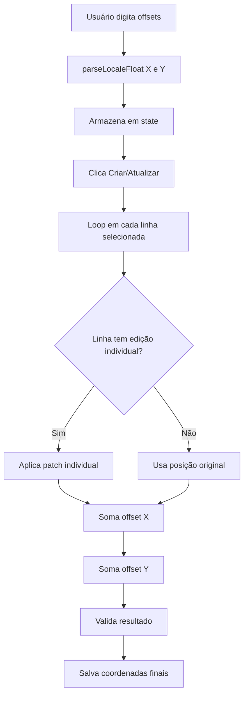

import { Steps, Aside, Tabs, TabItem } from '@astrojs/starlight/components';

O **Ajuste Global** permite deslocar todas as linhas selecionadas usando valores de offset X e Y, economizando tempo ao reposicionar layouts inteiros.

## Visão Geral

Em vez de editar linha por linha, você define um deslocamento que será aplicado a **todas as linhas** no momento da criação/atualização.

**Casos de uso:**
- Reposicionar design completo após mudança de imagem
- Ajustar centralização de conjunto de elementos
- Compensar diferenças de tamanho entre produtos
- Corrigir alinhamento em lote

<Aside type="tip">
O ajuste global é aplicado **depois** das edições individuais de linha. Você pode combinar ambos: editar algumas linhas manualmente e aplicar offset global em todas.
</Aside>

## Interface do Painel

O painel de ajuste global aparece abaixo da lista de linhas:

```
┌─────────────────────────────────────────┐
│  📐 Ajuste Global de Posição            │
│                                         │
│  Offset X (horizontal): [    0    ]    │
│  Offset Y (vertical):   [    0    ]    │
│                                         │
│  ℹ️ Valores serão somados às posições  │
│     de todas as linhas selecionadas.   │
│     Use valores negativos para mover   │
│     à esquerda ou para cima.           │
└─────────────────────────────────────────┘
```

### Campos

- **Offset X:** Deslocamento horizontal em pixels
- **Offset Y:** Deslocamento vertical em pixels

### Formato Aceito

Ambos os campos aceitam:
- ✅ Números inteiros: `10`, `-5`, `0`
- ✅ Decimais com ponto: `10.5`, `-2.25`
- ✅ Decimais com vírgula (PT-BR): `10,5`, `-2,25`
- ✅ Notação de milhares: `1.234`, `1.234,56`

<Aside type="note">
**Suporte PT-BR completo:** O plugin converte automaticamente vírgula para ponto e remove separadores de milhares antes de calcular. Você pode usar o formato que preferir.
</Aside>

## Como Usar

<Steps>

1. **Carregue o conteúdo**
   
   Clique em "Carregar conteúdo do produto base" para popular as linhas.

2. **Selecione as linhas** (opcional)
   
   Se quiser aplicar offset apenas em algumas linhas, use os checkboxes. Se deixar todas marcadas, o offset será aplicado em todas.

3. **Digite os valores de offset**
   
   - **Offset X positivo:** move à direita
   - **Offset X negativo:** move à esquerda
   - **Offset Y positivo:** move para baixo
   - **Offset Y negativo:** move para cima

4. **Combine com edições individuais** (opcional)
   
   Você pode editar linhas específicas E aplicar offset global. O resultado será:
   
   ```
   Posição final = Posição original + Edição individual + Offset global
   ```

5. **Aplique**
   
   Clique em "Criar Produto" ou "Atualizar Produtos". O offset será aplicado automaticamente.

</Steps>

## Exemplos Práticos

### Exemplo 1: Centralizar design após troca de imagem

**Situação:**
- Imagem antiga: 400px de largura
- Imagem nova: 500px de largura
- Design precisa se deslocar 50px à direita para centralizar

**Solução:**
```
Offset X: 50
Offset Y: 0
```

**Resultado:**
```
Linha "Título":      X: 100 → 150
Linha "Subtítulo":   X: 120 → 170
Linha "Logo":        X: 180 → 230
```

---

### Exemplo 2: Ajustar altura após mudança de template

**Situação:** Novo template tem header 30px mais alto

**Solução:**
```
Offset X: 0
Offset Y: 30
```

**Resultado:**
```
Linha "Nome":        Y: 50 → 80
Linha "Descrição":   Y: 80 → 110
Linha "Preço":       Y: 120 → 150
```

---

### Exemplo 3: Correção diagonal

**Situação:** Design completo está desalinhado -5px X e +10px Y

**Solução:**
```
Offset X: -5
Offset Y: 10
```

**Resultado:**
```
Linha "A":  (100, 200) → (95, 210)
Linha "B":  (150, 250) → (145, 260)
Linha "C":  (200, 300) → (195, 310)
```

---

### Exemplo 4: Combinando com edição individual

**Situação:** 
- Linha "Logo" precisa ajuste especial: Y +20
- Todas as outras: offset global Y -10

**Solução:**
1. Edite "Logo" individualmente: Y = original + 20
2. Defina offset global: Y = -10

**Resultado:**
```
Logo:         Y: 50 → (50 + 20) → (70 - 10) = 60
Título:       Y: 100 → (100 - 10) = 90
Subtítulo:    Y: 150 → (150 - 10) = 140
```

<Aside type="caution">
**Ordem de aplicação:**
1. Posição original
2. Edição individual (se houver)
3. Offset global

Tenha isso em mente ao combinar ambos os métodos.
</Aside>

## Formato de Entrada PT-BR

### Suporte a Vírgula Decimal

Você pode usar vírgula como separador decimal:

| Entrada | Interpretado como | Aplicado como |
|---------|-------------------|---------------|
| `10,5` | 10.5 | 10.5 |
| `-0,5` | -0.5 | -0.5 |
| `41,111` | 41.111 | 41.111 |
| `1.234,56` | 1234.56 | 1234.56 |

### Remoção de Separadores de Milhares

O plugin remove pontos usados como separadores de milhares:

| Entrada | Limpeza | Conversão | Resultado |
|---------|---------|-----------|-----------|
| `1.000` | `1000` | parseFloat | 1000 |
| `1.234,56` | `1234,56` | `1234.56` | 1234.56 |
| `10.000,5` | `10000,5` | `10000.5` | 10000.5 |

<Aside type="note">
**Ambiguidade resolvida:** Se detectar vírgula no valor, pontos são tratados como separadores de milhares. Se não houver vírgula, pontos são decimais.
</Aside>

### Preservação de Formato

Ao exibir valores de volta ao usuário, o plugin preserva o formato original:

```javascript
// Entrada: "-0,5"
parseLocaleFloat("-0,5") // → -0.5
formatLikeOriginal(-0.5, "-0,5") // → "-0,5"

// Entrada: "41.5"  
parseLocaleFloat("41.5") // → 41.5
formatLikeOriginal(41.5, "41.5") // → "41.5"
```

## Validação e Sanitização

### Front-end (JavaScript)

```javascript
function parseLocaleFloat(value) {
  const str = String(value).trim();
  if (!str) return 0;
  
  const hasComma = str.includes(',');
  let normalized = str;
  
  if (hasComma) {
    // Remove pontos (milhares) e troca vírgula por ponto
    normalized = str.replace(/\./g, '').replace(',', '.');
  }
  
  const num = parseFloat(normalized);
  return isNaN(num) ? 0 : num;
}
```

**Exemplos:**
- `parseLocaleFloat("10,5")` → `10.5`
- `parseLocaleFloat("-0,5")` → `-0.5`
- `parseLocaleFloat("abc")` → `0`

### Back-end (PHP)

```php
// Em sanitize_row_patch()
if (is_numeric($raw_val)) {
    $sanitized[$key] = floatval($raw_val);
} elseif (is_string($raw_val)) {
    // Normaliza vírgula para ponto
    $normalized = str_replace(',', '.', $raw_val);
    if (is_numeric($normalized)) {
        $sanitized[$key] = floatval($normalized);
    }
}
```

**Exemplos:**
- `"41,5"` → `str_replace` → `"41.5"` → `floatval` → `41.5`
- `"abc"` → não numérico → removido do patch

## Fluxo de Aplicação



### Pseudocódigo

```javascript
// Para cada linha selecionada
rows.forEach((row, index) => {
  // 1. Obter posição base
  let x = row.x || row.left || 0;
  let y = row.y || row.top || 0;
  
  // 2. Aplicar edição individual se existir
  const edit = editedRows.find(e => e.index === index);
  if (edit) {
    if (edit.patch.x !== undefined) x = edit.patch.x;
    if (edit.patch.y !== undefined) y = edit.patch.y;
  }
  
  // 3. Aplicar offset global
  x += parseLocaleFloat(offsetX);
  y += parseLocaleFloat(offsetY);
  
  // 4. Atualizar linha
  const xKey = getActualKey(['x', 'left']);
  const yKey = getActualKey(['y', 'top']);
  row[xKey] = x;
  row[yKey] = y;
});
```

## Casos Extremos

### Valores muito grandes

**Entrada:** `Offset X: 10000`

**Resultado:** Elementos ficarão fora da canvas visível, mas tecnicamente válido.

<Aside type="caution">
Não há validação de limites máximos. Certifique-se que os valores resultantes fazem sentido para seu layout.
</Aside>

---

### Valores muito pequenos

**Entrada:** `Offset X: 0.001`

**Resultado:** Deslocamento imperceptível, mas aplicado corretamente.

---

### Mistura de formatos

**Entrada:** 
```
Offset X: 10,5   (PT-BR)
Offset Y: -2.25  (EN-US)
```

**Resultado:** Ambos funcionam! Plugin detecta e converte automaticamente.

---

### Offset zero

**Entrada:** `Offset X: 0, Offset Y: 0`

**Resultado:** Nenhuma mudança aplicada, mas não causa erro.

## Dicas e Boas Práticas

### ✅ Recomendações

1. **Teste com 1 produto primeiro** antes de aplicar em lote
2. **Use preview** para verificar resultado antes de salvar
3. **Anote offsets usados** para reproduzir em outros produtos
4. **Valores pequenos para ajustes finos:** `±1` a `±5`
5. **Valores médios para reposicionamento:** `±10` a `±50`

### ❌ Evite

1. **Offsets gigantes** sem motivo (>500px)
2. **Confiar apenas em offset** - verifique visualmente
3. **Esquecer de selecionar linhas** - offset só age nas marcadas
4. **Acumular offsets** - cada aplicação é independente

## Limitações

1. **Não pode desfazer** depois de aplicar (recarregue página antes)
2. **Não mostra preview em tempo real** (use sistema de preview separado)
3. **Aplica em todas as linhas selecionadas** (não há filtro por tipo)
4. **Não valida limites de canvas** (pode colocar elementos fora)

## Troubleshooting

### Problema: Offset não foi aplicado

**Causas:**
- Campos vazios (interpretados como 0)
- Linhas não selecionadas (checkboxes desmarcados)
- Erro de parsing (texto inválido)

**Solução:** Verifique console do navegador e valores digitados.

---

### Problema: Formato com vírgula não funciona

**Causa:** JavaScript nativo não reconhece vírgula

**Solução:** Certifique-se de usar versão atualizada do plugin com `parseLocaleFloat()`.

---

### Problema: Resultado diferente do esperado

**Causa:** Esqueceu que offset é somado às edições individuais

**Solução:** 
```
Posição final = Original + Edição individual + Offset global
```

Recalcule considerando todas as camadas.

## Próximos Passos

- **[Editando Posições](/guias/editando-posicoes/)** - Ajustes individuais de linhas
- **[Sistema de Preview](/funcionalidades/sistema-preview/)** - Visualizar antes de aplicar
- **[Suporte a Locale](/funcionalidades/suporte-locale/)** - Detalhes técnicos de PT-BR/EN-US
