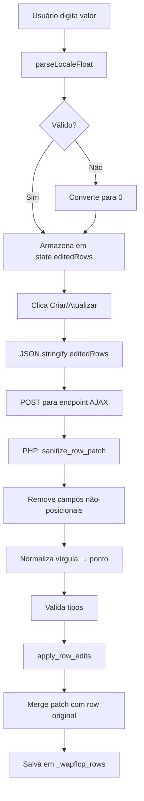

import { Steps, Aside, Tabs, TabItem } from '@astrojs/starlight/components';

Este guia explica como editar posições de elementos individuais usando o editor de linhas do WC Product Creator.

## Conceitos Básicos

### Sistema de Coordenadas

O plugin usa um sistema de coordenadas 2D:

```
(0,0) ┌─────────────────────┐
      │                     │
      │   (X, Y)            │
      │     ●               │
      │                     │
      │                     │
      └─────────────────────┘
                          (max X, max Y)
```

- **Eixo X (horizontal):** valores aumentam da esquerda para direita
- **Eixo Y (vertical):** valores aumentam de cima para baixo
- **Origem:** canto superior esquerdo da canvas

<Aside type="note">
Coordenadas podem usar **aliases**: `x`/`left` e `y`/`top` são intercambiáveis. O plugin detecta automaticamente qual seu produto usa.
</Aside>

## Propriedades Editáveis vs Bloqueadas

### ✅ Editáveis (Position-Only)

Apenas as coordenadas de posicionamento podem ser modificadas:

| Propriedade | Aliases | Tipo | Descrição |
|-------------|---------|------|-----------|
| X | `x`, `left` | Número | Posição horizontal (pixels) |
| Y | `y`, `top` | Número | Posição vertical (pixels) |

### 🔒 Bloqueadas (Herdadas do Produto Base)

As seguintes propriedades **não podem ser editadas** e são sempre herdadas:

- **Dimensões:** `width`, `height`, `w`, `h`, `size`
- **Cores:** `color`, `fill`, `stroke`
- **Rotação:** `rotate`, `rotation`, `angle`
- **Alinhamento:** `align`, `text-align`, `valign`
- **Tipografia:** `font-size`, `font-family`, `font-weight`
- **Efeitos:** `opacity`, `shadow`, `border`

<Aside type="caution">
**Por que bloquear?** Manter estilos consistentes garante que produtos derivados respeitem o design original. Se precisar mudar cores ou tamanhos, edite o produto base e re-aplique.
</Aside>

## Interface do Editor

### Expandindo uma Linha

Cada linha aparece como um card `<details>`:

```
┌─────────────────────────────────────┐
│ ▶ Nome centralizado                 │
│   🎨 Cores do produto-origem        │
└─────────────────────────────────────┘
```

Ao clicar, expande para:

```
┌─────────────────────────────────────┐
│ ▼ Nome centralizado                 │
│   🎨 Cores do produto-origem        │
│                                     │
│   Posição X: [  150  ]              │
│   Posição Y: [  200  ]              │
│                                     │
│   ℹ️ Somente posições podem ser    │
│      editadas. Cores e tamanhos    │
│      são herdados do produto base. │
└─────────────────────────────────────┘
```

### Campos de Entrada

- **Formato aceito:** Números inteiros ou decimais
- **Separador decimal:** Vírgula (`,`) ou ponto (`.`)
- **Exemplos válidos:** `100`, `150.5`, `41,111`, `-10`, `-0,5`

<Aside type="tip">
**Suporte PT-BR:** Você pode usar vírgula como separador decimal (`41,5`) ou notação de milhares (`1.234,56`). O plugin converte automaticamente.
</Aside>

## Editando Posições

<Steps>

1. **Carregue o conteúdo do produto base**
   
   Clique em "Carregar conteúdo do produto base" para popular as linhas.

2. **Localize a linha desejada**
   
   Use a busca ou role pela lista de cards. Cada card mostra:
   - Rótulo derivado (nome do campo ou attachment)
   - Badge "Cores do produto-origem" se linha usa cor do base

3. **Expanda o card**
   
   Clique no card para revelar os campos de edição.

4. **Ajuste as coordenadas**
   
   Digite os novos valores de X e/ou Y:
   
   - Para mover **à direita:** aumente X
   - Para mover **à esquerda:** diminua X
   - Para mover **para baixo:** aumente Y
   - Para mover **para cima:** diminua Y

5. **Valores negativos são permitidos**
   
   Você pode usar coordenadas negativas se o design precisar:
   
   ```
   X: -20  (20 pixels fora da canvas à esquerda)
   Y: -5   (5 pixels acima da canvas)
   ```

6. **Mudanças são armazenadas localmente**
   
   Suas edições ficam em memória até clicar em "Criar Produto" ou "Atualizar Produtos".

</Steps>

## Exemplos Práticos

### Exemplo 1: Centralizar texto

**Situação:** Texto está desalinhado após trocar imagem de fundo

**Solução:**
```
Canvas: 500px de largura
Texto atual: X = 100 (desalinhado)
Largura do texto: 200px

Centro = (500 - 200) / 2 = 150

Novo valor: X = 150
```

---

### Exemplo 2: Ajustar logo após mudança de layout

**Antes:**
```
Logo:
  X: 50
  Y: 50
```

**Designer pediu:** "Mover 20px à direita e 10px para baixo"

**Depois:**
```
Logo:
  X: 70  (50 + 20)
  Y: 60  (50 + 10)
```

---

### Exemplo 3: Alinhar múltiplos elementos

**Situação:** 3 textos em alturas diferentes

**Objetivo:** Alinhar todos em Y = 200

**Edições:**
```
Texto 1: Y = 180 → 200  (+20)
Texto 2: Y = 195 → 200  (+5)
Texto 3: Y = 210 → 200  (-10)
```

<Aside type="tip">
Se todos precisam do mesmo deslocamento relativo, use **[Ajuste Global](/guias/ajuste-global/)** em vez de editar um por um.
</Aside>

## Formato de Dados

### Estrutura de Edição

Internamente, edições são armazenadas como:

```javascript
{
  index: 2,           // Índice da linha no array original
  patch: {
    x: 150,          // Novo valor de X
    y: 200           // Novo valor de Y
  }
}
```

### Sanitização

Antes de aplicar, o plugin sanitiza os valores:

1. **Detecta schema** da linha (quais keys existem)
2. **Remove campos não-posicionais** (cor, tamanho, etc.)
3. **Valida tipos:**
   - Números: converte e verifica se é finito
   - Enums: verifica se valor está na lista
   - Strings: escapa HTML
4. **Normaliza locale:** `41,5` → `41.5` (vírgula vira ponto)

<Tabs>
<TabItem label="Entrada do Usuário">

```javascript
// O que você digita na interface
{
  index: 0,
  patch: {
    x: "41,5",        // String com vírgula PT-BR
    y: 200,
    color: "#ff0000", // ⚠️ Campo bloqueado
    size: 24          // ⚠️ Campo bloqueado
  }
}
```

</TabItem>

<TabItem label="Após Sanitização">

```javascript
// O que é realmente aplicado
{
  index: 0,
  patch: {
    x: 41.5,          // Convertido para número
    y: 200            // Mantido
    // color e size foram removidos
  }
}
```

</TabItem>
</Tabs>

## Aliases de Coordenadas

Diferentes plugins/builders usam diferentes nomes para as mesmas propriedades:

| Propriedade | Possíveis nomes no schema |
|-------------|---------------------------|
| Posição X | `x`, `left`, `posX` |
| Posição Y | `y`, `top`, `posY` |

**Detecção automática:** O plugin usa `getActualKey(['x', 'left'])` para descobrir qual nome seu produto usa.

<Aside>
Se sua linha usa `left` em vez de `x`, o editor mostrará "Posição X" mas salvará como `left` internamente.
</Aside>

## Validação e Erros

### Valores Válidos

✅ **Aceitos:**
- Inteiros: `100`, `-50`
- Decimais com ponto: `150.5`, `-10.25`
- Decimais com vírgula: `41,5`, `1.234,56`
- Zero: `0`

❌ **Rejeitados:**
- Texto: `"abc"`, `"10px"`
- Infinito: `Infinity`, `-Infinity`
- NaN: resultado de divisão por zero
- Valores vazios convertidos para `0`

### Comportamento em Caso de Erro

Se um valor inválido for detectado:

1. **Front-end (script.js):**
   - `parseLocaleFloat()` retorna `0` ou mantém original
   - Exibe valor como digitado até aplicar

2. **Back-end (PHP):**
   - `sanitize_row_patch()` remove entrada inválida
   - Linha é aplicada com apenas os campos válidos
   - Sem erro fatal; operação continua

<Aside type="caution">
**Dados silenciosamente ignorados:** Se digitar texto em X, esse campo será removido mas Y ainda será aplicado. Verifique o console do navegador para avisos.
</Aside>

## Limitações e Contornos

### Limitação 1: Não pode editar múltiplas linhas simultaneamente

**Contorno:** Use [Ajuste Global](/guias/ajuste-global/) para aplicar offset em todas.

---

### Limitação 2: Não pode copiar coordenadas entre linhas

**Contorno:** Anote o valor e digite manualmente em outra linha.

---

### Limitação 3: Não pode desfazer edição individual

**Contorno:** Recarregue a página para resetar todas as edições.

---

### Limitação 4: Não pode editar após criar/atualizar

**Contorno:** Para ajustar produto já criado, use modo Atualizar novamente com o produto como destino.

## Fluxo Técnico Completo



## Próximos Passos

- **[Ajuste Global](/guias/ajuste-global/)** - Mover todas as linhas de uma vez
- **[Sistema de Preview](/funcionalidades/sistema-preview/)** - Visualizar mudanças antes de aplicar
- **[Referência: Edição Somente Posição](/funcionalidades/edicao-somente-posicao/)** - Arquitetura da restrição
